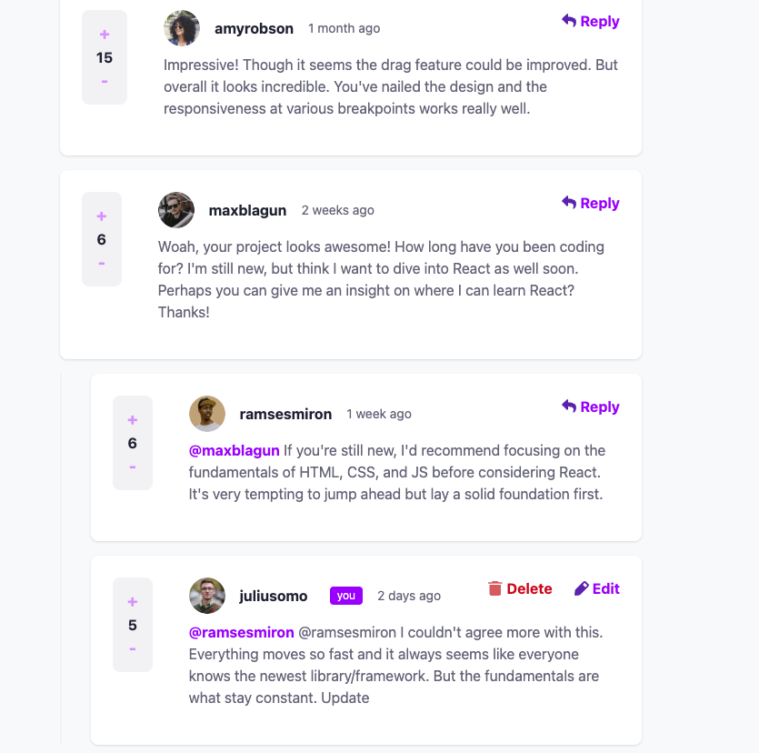

# Frontend Mentor - Interactive Comments Section

This is my solution to the [Interactive Comments Section challenge on Frontend Mentor](https://www.frontendmentor.io/challenges/interactive-comments-section-iG1RugEG9). The goal was to build a fully interactive comments section with responsive design, CRUD functionality, upvoting/downvoting, and localStorage persistence.

## Table of Contents

- [Overview](#overview)
- [Features](#features)
- [Screenshot](#screenshot)
- [Live Demo](#live-demo)
- [Built With](#built-with)
- [How to Use](#how-to-use)
- [What I Learned](#what-i-learned)
- [Useful Resources](#useful-resources)
- [Author](#author)

## Overview

This project is a responsive, interactive comments section that allows users to add, reply, edit, delete, upvote, and downvote comments. All data is persisted in the browser using `localStorage`.

## Features

- Responsive layout for mobile, tablet, and desktop
- Add, edit, and delete comments and replies
- Upvote and downvote comments and replies
- Confirmation modal for deleting comments
- All state is saved in `localStorage` and persists on refresh

## Screenshot

## Live Demo

- [Live Site URL](https://your-live-site-url.com)

## Built With

- Semantic HTML5
- Tailwind CSS (utility-first, responsive)
- Vanilla JavaScript (ES6+)
- Mobile-first workflow
- LocalStorage for persistence

## How to Use

1. Clone the repository.
2. Open `index.html` in your browser.
3. Add, reply, edit, delete, upvote, and downvote comments as you wish.
4. All changes are saved automatically in your browser.

## What I Learned

- How to structure a fully interactive UI with vanilla JavaScript.
- Responsive layouts using Tailwind CSS and utility classes.
- Managing state and persisting it with `localStorage`.
- Handling dynamic DOM updates and event delegation.
- Creating accessible modals and confirmation dialogs.

## Useful Resources

- [Frontend Mentor](https://www.frontendmentor.io/)
- [Tailwind CSS Documentation](https://tailwindcss.com/docs)
- [MDN Web Docs - localStorage](https://developer.mozilla.org/en-US/docs/Web/API/Window/localStorage)
- [The Markdown Guide](https://www.markdownguide.org/)

## Author

- GitHub: [your-github-username](https://github.com/PCollinx)
- Website - Working on it!
- Frontend Mentor - [@PCollinx](https://www.frontendmentor.io/profile/PCollinx)
- Twitter - [@twiceatwt](https://www.twitter.com/twiceatwt)

## Acknowledgments

Thanks to Frontend Mentor for the challenge and the community for inspiration and support!
